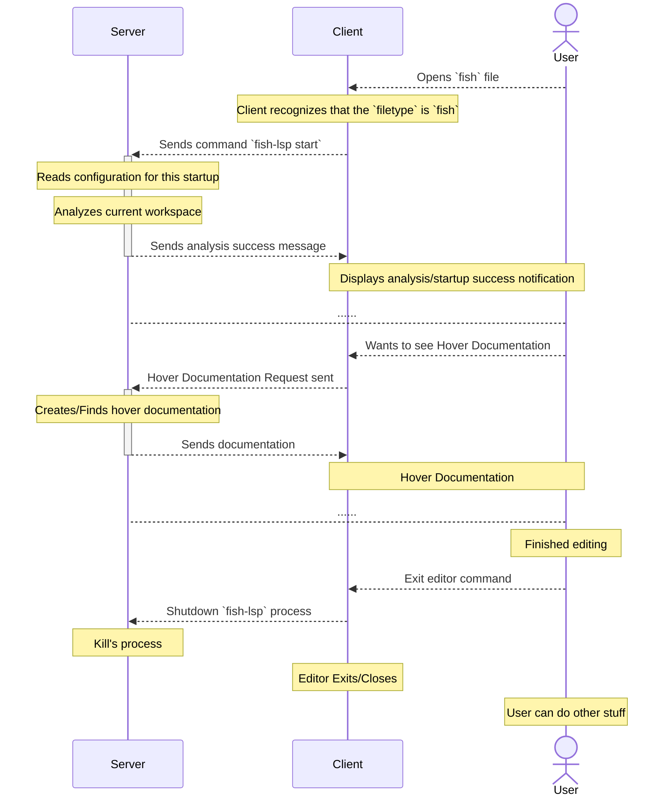

<h1 style="display: flex; align-items: center; justify-items: center; text-align: center;">
     FISH-LSP
</h1>


A [Language Server Protocol (LSP)](https://lsif.dev/) tailored for the [fish shell](https://github.com/microsoft/vscode-languageserver-node/tree/main/server/src/common).
This project aims to enhance the coding experience for fish, by introducing a suite of
intelligent features like auto-completion, scope aware symbol analysis, per-token hover
generation, and [many others](#features).

The overall project goal is to produce an editor agnostic developer environment for fish.

### Client Usage

  

 <!-- > [!NOTE] -->
 <!-- > _Please submit other demo's in_ [show & tell](https://github.com/ndonfris/fish-lsp/discussions/categories/show-and-tell) _discussion_ -->

### Server Usage

  <!-- ```bash -->
  <!--  fish-lsp --help -->
  <!-- ``` -->
  <!---->
  <!-- <details> -->
  <!--   <summary> Generated Output </summary> -->

  

  <!-- </details> -->

## Installation

> __Recommended Dependencies:__ `yarn@1.22.22`, `node@21.7.1`, `fish@3.7.1`

Building from source is __the only currently recommended installation method__, as we improve
other methods of the installation process (Don't use __releases__ or __npm package__).
Contributions to help enhance installation options are greatly appreciated!

1. Clone the repo

    ```bash
    git clone https://github.com/ndonfris/fish-lsp
    # cd fish-lsp
    ```

1. Install the dependencies & run the setup handler scripts

    ```bash
    yarn install
    ```

1. __Optional:__ Check that the project successfully compiled & linked

    ```bash
    # ./bin/fish-lsp --help
    fish-lsp --help
    ```

1. Setup the project in the [client](https://github.com/ndonfris/fish-lsp/wiki/Client-Configurations) of your choice. _Client's typically only need the keys `command`,
   `args/arguments`, and `filetypes` to start a language server._

    ```json
    {
      "fish-lsp": {
        "command": "fish-lsp",
        "filetypes": ["fish"],
        "args": ["start"],
        "revealOutputChannelOn": "info",
        "initializationOptions": {
          "workspaces": {
            "paths": {
              "defaults": [
                "$HOME/.config/fish",
                "/usr/share/fish"
              ]
            }
          }
        }
      }
    }
    ```

    > Neovim client using [coc.nvim](https://github.com/neoclide/coc.nvim) configuartion, located inside [coc-settings.json](https://github.com/neoclide/coc.nvim/wiki/Language-servers#register-custom-language-servers) `"languageserver"` key

## Features

| Feature | Description | Status |
| --- | --- | --- |
| __Completion__ | Provides completions for commands, variables, and functions | ✅ |
| __Hover__ | Shows documentation for commands, variables, and functions. Has special handlers for `--flag`, `commands`, `functions`, `variables` | ✅ |
| __Signature Help__ | Shows the signature of a command or function | ✖  |
| __Goto Definition__ | Jumps to the definition of a command, variable, or function | ✅ |
| __Find References__ | Shows all references to a command, variable, or function | ✅ |
| __Rename__ | Rename within _matching_ __global__ && __local__ scope | ✅ |
| __Document Symbols__ | Shows all commands, variables, and functions in a document | ✅ |
| __Workspace Symbols__ | Shows all commands, variables, and functions in a workspace | ✅ |
| __Document Formatting__ | Formats a document, _full_ & _selection_ | ✅ |
| __Document Highlight__ / __Semantic Token__ | Highlights all references to a command, variable, or function.  | ✖  |
| __Command Execution__ | Executes a server command from the client | ✖  |
| __Code Action__ | Shows all available code actions | ✖  |
| __Code Lens__ | Shows all available code lenses | ✖  |
| __Logger__ | Logs all server activity | ✅ |
| __Diagnostic__ | Shows all diagnostics | ✖  |
| __Telescope Integration__ | Integrates with the telescope.nvim plugin | ✅ |
| __CLI Interactivity__ | Provides a CLI for server interaction. Built by `fish-lsp complete <option>` | ✅ |
| __Client Tree__ | Shows the defined scope as a Tree | ✅ |
| __Indexing__ | Indexes all commands, variables, and functions | ✅ |

## Why?

  The creation of this project was driven by a vision to bridge the gap in tooling for the
  fish shell, independently separating the shell's community by text-editor/IDE.

<!-- ### Pros of fish shell -->
<!---->
<!--   Fish stands out among shell environments due to its advanced, user-friendly language -->
<!--   design, which is inherently more structured and intuitive than traditional shells. This modern -->
<!--   design simplifies script development, enhances readability, and supports robust error handling, -->
<!--   making it an ideal candidate for a dedicated LSP. By leveraging Fish’s unique features through an LSP, -->
<!--   developers can harness its full potential, benefiting from intelligent autocomplete, syntax highlighting, -->
<!--   and real-time feedback that align seamlessly with Fish's syntax. Building an LSP for -->
<!--   Fish not only taps into these innate capabilities but also enriches the user experience, -->
<!--   making advanced shell scripting more accessible and productive. -->

### Simplicity of fish's syntax

  Compared to other programming languages that feature LSP implementations, the syntax and
  language design of fish are notably straightforward. This simplicity theoretically
  facilitates the development of language server features, making them easier to
  conceptualize, document, and test. Additionally, the straightforward nature of fish’s
  design lowers the barrier to entry for understanding the project's core architecture,
  making it less daunting for users to contribute their own feature requests and enhancements.

### Challenges

  Since its inception, __fish-lsp__ has undergone substantial changes, requiring frequent refactoring
  and even the temporary exclusion of certain features to maintain compatibility and performance
  with evolving LSP standards. These modifications have often led to extensive rewrites of
  significant sections throughout the project. As a result, some features are currently on hold until
  they can be seamlessly integrated into the updated framework.

  Your sponsorship and/or contributions are vital to continuing the development and refinement of __fish-lsp__,
  ensuring it remains a valuable tool for the community.

## How

The LSP describes __both__ a [server](#server-usage) and [client's](#client-usage) communication abilities.
Text editor's (_or any other equivalent form of_ __langauge client__) are then able to choose which general
programming features will be implemented. This leaves current and future possibilities
supported by the server open ended.

Here is a diagram to display the langauge server protocol's typical use.



## Additional Resources

- [Contributing](./docs/CONTRIBUTING.md) - documentation describing how to contribute to the fish-lsp project.

- [Roadmap](./docs/ROADMAP.md) - goals for future project releases.

- [Wiki](https://github.com/ndonfris/fish-lsp/wiki) - further documentation and knowledge relevant to the project

- [Discussions](https://github.com/ndonfris/fish-lsp/discussions) - interact with maintainers

- [Site](https://fish-lsp.dev/) - website homepage

- [Client Examples](https://github.com/ndonfris/fish-lsp/wiki/Client-Configurations) - testable language client configurations

- [Sources](https://github.com/ndonfris/fish-lsp/wiki/Sources) - major influences for the project

<!-- Contributors list @via: https://allcontributors.org/docs/en/bot/installation -->
<!-- ## Contributing -->
<!---->
<!-- Contributions are included across any project relevant to the project [fish-lsp-language-clients](https://github.com/ndonfris/fish-lsp-language-clients/), -->
<!-- [fish-lsp.dev](https://https://github.com/ndonfris/fish-lsp.dev), and [this repo](https://github.com/ndonfris/fish-lsp). -->
<!---->
<!-- View the [CONTRIBUTING](./docs/CONTRIBUTING.md) file for more info. -->
<!---->
<!-- Special thanks to everyone who has helped on the project. -->
<!---->

## Contributors

<!-- ALL-CONTRIBUTORS-LIST:START - Do not remove or modify this section -->
<!-- prettier-ignore-start -->
<!-- markdownlint-disable -->
<!-- markdownlint-restore -->
<!-- prettier-ignore-end -->

<!-- ALL-CONTRIBUTORS-LIST:END -->


## License

[MIT](https://github.com/ndonfris/fish-lsp/blob/master/LICENSE)

